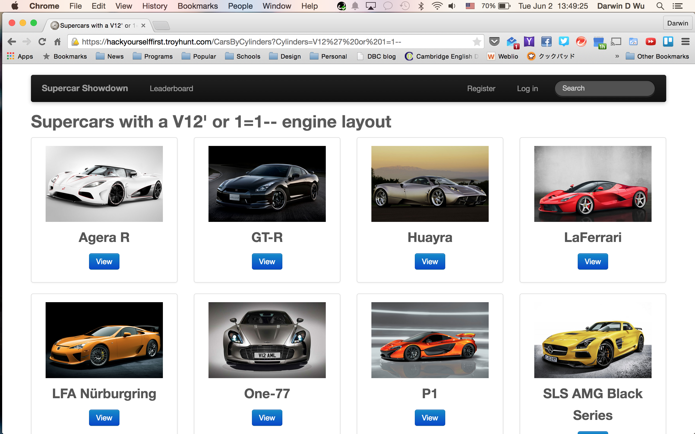
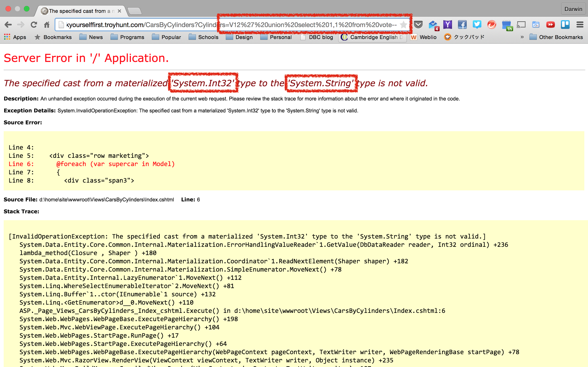

# SQL Vulnerabilities
A SQL Injection attack consists of insertion or "injection" of a SQL query via the input data from the client to the application. A successful SQL injection exploit can read sensitive data from the database, modify database data (Insert/Update/Delete), execute administration operations on the database (such as shutdown the DBMS), and more!  

- Standard Injection
- Union Exploitation
- Error Based Exploitation
- Boolean Exploitation
- Time Delay Exploitation
  
etc.


#### Standard Injection
One of the most famous attacks are the `1=1 Always True` standard injections. If this injection is successful, the attacker will be able to pull out all the data from the current table. The sample below is a example of an injection from the URL.
```url
www.example.com/users/1' or 1=1--
```

*Sample Picture*

*%27 and %20 is how the browser interpret ' and space*


Basicly SQL injections always start with a quote(`' or "`), because when the sample url above is used to query the database, the underlying SQL query will most likely to be a string like this.
```sql
SELECT * FROM users
WHERE users.id = '1'
```
Therefore, adding a quote to the end of the URL will end that query and you are able to add additional commands to it. `1=1` or `x=x` are the most seen examples but it doesn't matter what you put at both sides of the `=` as long as they are the same things. The result of this query will be always be `true`, which means that the database will take out everything it can find and that means *everything*.
The `--` after `1=1` is the comment syntax in SQL. By adding this to the end of the injection, it will comment out any other following commands after the injected query. Therefore the injected query will be the last thing for the database to see, and will give the hacker everything they are looking for.


#### Union Exploitation
The Union operator is used in SQL injections to join a extra query to the original query purposely by the attacker. The result of the forged query will be joined with the original query and allows the attacker to gain access to the columns and values of other tables. An example of a Union Injection in the URL will look like this.
```url
www.example.com/users/1' union select 1,1 from vote--
```
The SQL query in the example above is trying to do something like this.
```sql
SELECT * FROM users
WHERE users.id = 1
UNION
SELECT 1, 1 FROM votes
```
What this query is trying to do is to first select a user from the user table with the id 1 *and also* select the column 1 and 1 from the table votes. I suppossed some people are confused at this point. What in the world does `1, 1` do? This is actually a combination of Union Exploitation and Error Based Exploitation (I will go into details about this later). In the place of `1, 1`, it would be replaced column names of the table the attacker is looking for. So I think it will make more sense if I write it like this.
```sql
SELECT * FROM users
WHERE users.id = 1
UNION
SELECT votes.id, votes.user_id FROM votes
```
This is an effective way of extracting values from the database when you know the name of the tables or columns.

*Abstract example*
```url
<URL>' union select <column name> from <table name>
```


#### Error Based Exploitation
Error based injections are a way for an attacker to gain information about the database by intentionally passing the wrong syntax when injecting queries. It's a way for an attacker to guess what kind of tables or columns there are in the database.  
  
Sample Picture

